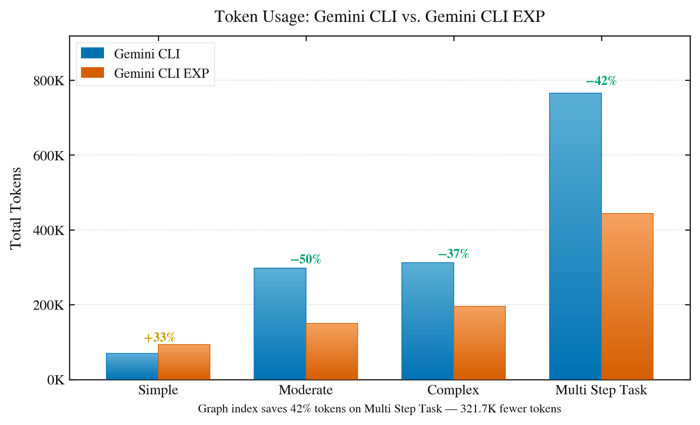
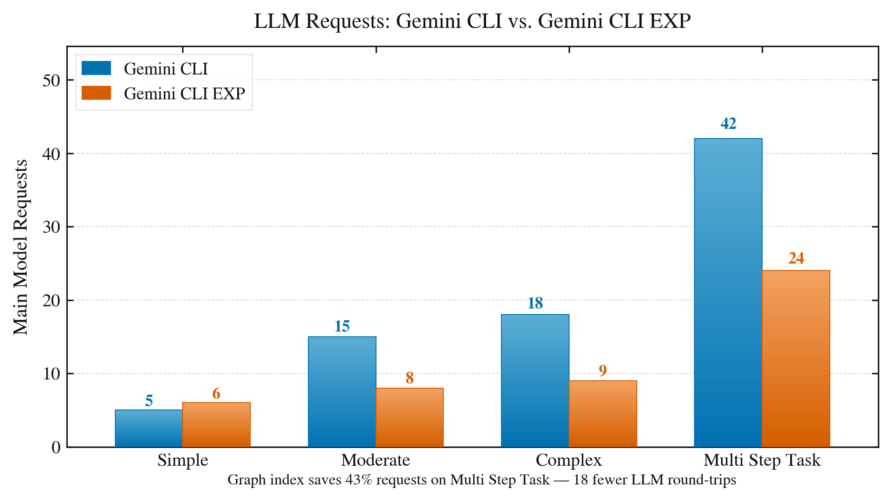
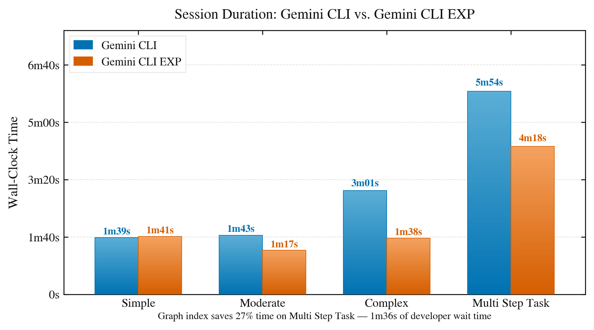
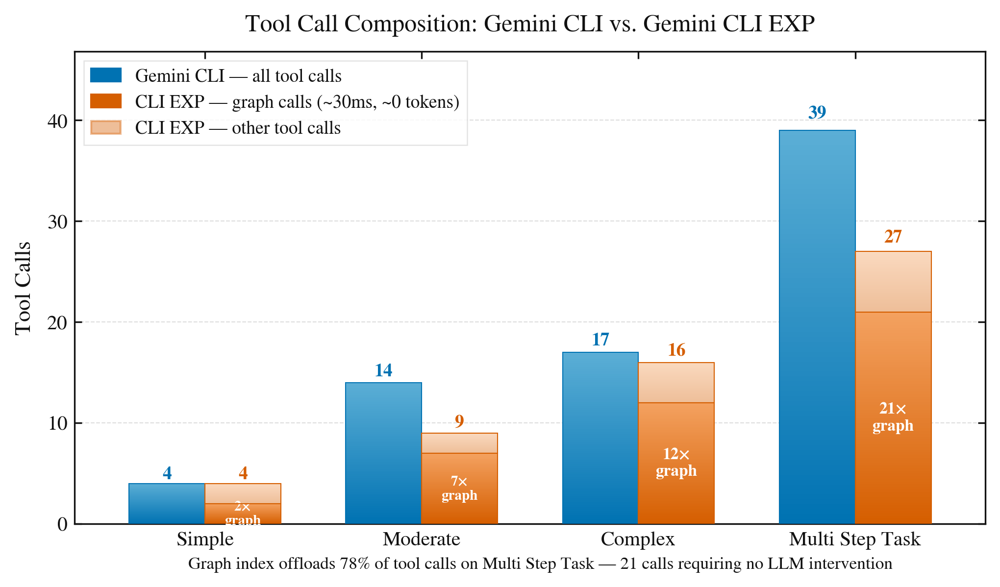
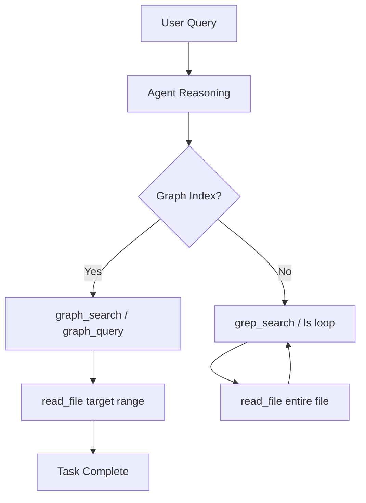

<div align="center">


# Gemini CLI — Experimental Fork

[](.)
[](./LICENSE)
[](.)
[](https://github.com/google-gemini/gemini-cli)

> **This is not the official Gemini CLI.** This is an experimental fork that
> changes how the agent navigates codebases at a protocol level. Use at your own
> risk. Things will break. That is expected.

## Fork Built by : Ashwin Shirke

</div>

## What Makes This Different

The official Gemini CLI uses a standard **ReAct loop** (Reason → Act → Observe)
where codebase navigation resolves through file I/O — grep, read_file, glob —
iterating 4–10 turns per navigation query, burning tokens and time proportional
to codebase size.

The G+ReAct follows a different approach. It uses a SQLite-backed code index
(`.gemini/gemini.idx`) that is built once with `/idx`. This index is **auto-refreshed every session start and every hour**. Every agent
— main model and subagents — queries the graph before touching the filesystem.

Benchmark on a medium-sized codebase, broken down by task complexity.

<table>
  <tr>
    <td></td>
    <td></td>
  </tr>
  <tr>
    <td></td>
    <td></td>
  </tr>
</table>

| Task Complexity | Tokens (Standard) | Tokens (G+ReAct) | Wall Time (Standard) | Wall Time (G+ReAct) | Requests (Standard) | Requests (G+ReAct) |
| --------------- | ----------------- | ---------------- | -------------------- | ------------------- | ------------------- | ------------------ |
| Simple          | 70K               | 93K              | 99s                  | 101s                | 5                   | 6                  |
| Moderate        | 298K              | 150K             | 103s                 | 77s                 | 15                  | 8                  |
| Complex         | 313K              | 196K             | 181s                 | 98s                 | 18                  | 9                  |
| Tricky          | 765K              | 444K             | 354s                 | 258s                | 42                  | 24                 |

Graph tool call breakdown (G+ReAct): Simple 2 graph + 2 other, Moderate 7
graph + 2 other, Complex 12 graph + 4 other, Tricky 21 graph + 6 other.

### Key Takeaways

- **Token Efficiency (moderate+ tasks)**: G+ReAct reduces total tokens by 37–50%
  on moderate, complex, and tricky tasks by replacing iterative grep/read cycles
  with targeted graph lookups. On simple tasks with few symbol lookups, the
  index overhead results in slightly higher token use — the benefit is
  structural navigation, not flat file reads.
- **Request Reduction**: G+ReAct requires 43–50% fewer model requests on
  moderate and above tasks. Each graph call resolves a lookup that would
  otherwise require 1–3 additional model turns.
- **Latency Advantage**: Graph lookups resolve the full dependency/caller chain
  in a single ~38ms call. A grep is comparably fast (~40ms) but typically
  triggers multiple follow-up `read_file` turns; G+ReAct avoids those turns
  entirely.
- **Wall Time**: Up to 46% faster on complex tasks (181s → 98s). The gap widens
  with task complexity as the standard agent's iterative loop compounds.
- **When the advantage is smallest**: Simple tasks involving only a few direct
  file reads show near-identical performance. The graph index adds a small
  overhead with no structural navigation payoff.

For the full technical breakdown of the implementation, the loop mechanics, and
how G+ReAct differs from standard ReAct at the code level, read
**[idx_readme.md](./idx_docs/idx_readme.md)**.

---

## Benchmark Sessions

The [`idx_docs/`](./idx_docs/) directory contains raw demo session recordings
used to produce the numbers above. Each session runs the same query against the
same codebase on both agents so the comparison is direct:

| File                        | Description                                       |
| --------------------------- | ------------------------------------------------- |
| `cli_simple.txt`            | Standard CLI — simple task session                |
| `cli_modrate.txt`           | Standard CLI — moderate task session              |
| `cli_complex.txt`           | Standard CLI — complex task session               |
| `exp_simple.txt`            | G+ReAct — simple task session                     |
| `exp_modrate.txt`           | G+ReAct — moderate task session                   |
| `exp_complex.txt`           | G+ReAct — complex task session                    |
| `plot1_tokens_light.png`    | Token comparison across task types                |
| `plot2_requests_light.png`  | Request count comparison                          |
| `plot3_walltime_light.png`  | Wall time comparison                              |
| `plot5_toolcalls_light.png` | Tool call breakdown                               |
| `metrics_summary.txt`       | Raw numbers behind all benchmark tables           |
| `findings.md`               | Full per-round session analysis and key takeaways |
| `idx_readme.md`             | Technical implementation reference for G+ReAct    |
| `EXP CLI.pdf`               | Slide deck — experimental CLI overview            |
| `EXP CLI 2.pdf`             | Slide deck — benchmark deep-dive                  |

The `.txt` files are unedited terminal output. You can read them side by side to
see exactly how the two agents handle the same query — the tool call sequence,
intermediate reasoning, and final answer are all visible.

---

## Key Changes vs Official CLI

| Area                  | Official CLI                 | This Fork                                    |
| --------------------- | ---------------------------- | -------------------------------------------- |
| Codebase navigation   | grep + read_file loop        | `graph_search` / `graph_query` — single turn |
| Subagent tool access  | grep, ls, read_file only     | Graph tools available to all agents          |
| GEMINI.md on re-index | Overwritten                  | Smart write — prepends only missing lines    |
| Index freshness       | Manual `/idx`                | Auto-refresh at session start + every 1hr    |
| Loop convergence      | O(files matching grep) turns | O(1) turns for symbol navigation             |
| Startup banner        | Starting CLI naming          | — you can see it above                       |

---

## Beta Disclaimer

This fork is in **active development and beta stage**. You should:

- Expect breaking changes between versions
- Not use this in production workflows without understanding the changes
- Take full responsibility for any issues arising from use of this experimental
  build
- Treat the graph index as a best-effort cache — it can be stale or incomplete

**Large repository notice:** The current beta is **not suitable for very large
codebases** (projects with tens of thousands of files). The regex-based parser
has known coverage gaps on complex Python patterns and C extensions, and
indexing time at that scale has not been validated. All benchmarks and testing
were conducted on a medium-sized repository (up to a few thousand files).
Large-repo support is planned for a future release.

You have been warned. Now install it.

---

## Installation

This fork is **source-only**. There is no npm package. Build and link it
yourself:

```bash
# 1. Clone
git clone https://github.com/Ashwin3919/gemini-idx-cli.git &&
cd gemini-idx-cli

# 2. Install dependencies
npm install

# 3. Build
npm run build

# 4. Link globally — makes gemini_experimental available on your PATH
cd packages/cli
npm link
```

That's it. The command is `gemini_experimental`, not `gemini`. Your existing
`gemini` installation (if any) is untouched.

```bash
gemini_experimental --version
# 0.36.0-nightly.20260317.2f90b4653-exp2
```

---

## Getting Started with Code Indexing

Once installed, navigate to your project directory and initialize the graph
index:

```bash
cd your-project/
gemini_experimental

# Inside the CLI — run once to build the index
/idx
```

After that, the index auto-refreshes every time you start a session and every
hour while a session is running. You never need to manually run `/idx` again
unless you want to force an immediate re-index.

**Query the graph directly:**

```bash
> Where is the processPayment function defined?
> What calls validateUser?
> Trace the full call chain from handleRequest
```

The agent will use `graph_search` and `graph_query` instead of scanning files.

---

## Authentication

This fork uses the same authentication as the official CLI. All three options
work:

### Option 1 — Sign in with Google (recommended)

Best for individual developers. Free tier: 60 req/min, 1,000 req/day.

```bash
gemini_experimental
# Choose "Sign in with Google" and follow the browser flow
```

### Option 2 — Gemini API Key

```bash
export GEMINI_API_KEY="YOUR_API_KEY"
gemini_experimental
```

Get your key at
[aistudio.google.com/apikey](https://aistudio.google.com/apikey).

### Option 3 — Vertex AI (Enterprise)

```bash
export GOOGLE_API_KEY="YOUR_API_KEY"
export GOOGLE_GENAI_USE_VERTEXAI=true
gemini_experimental
```

For full auth documentation see the
[upstream auth guide](./docs/get-started/authentication.md).

---

## Usage

Everything from the official CLI works. The fork adds:

| Command                | What it does                                                  |
| ---------------------- | ------------------------------------------------------------- |
| `/idx init`            | Build or rebuild the code graph index for the current project |
| `graph_search("name")` | Find where a symbol is defined — file, line, args             |
| `graph_query("name")`  | Trace full caller/callee chain for a symbol                   |

Standard CLI commands (`/help`, `/chat`, `/clear`, `/bug`, etc.) are unchanged.

```bash
# Start in current directory
gemini_experimental

# Non-interactive
gemini_experimental -p "What calls the authenticate function?"

# Specific model
gemini_experimental -m gemini-2.5-flash
```

---

## How G+ReAct Transforms the Loop

Standard ReAct agents navigate codebases by scanning files (`grep_search`) and
reading large chunks of text (`read_file`) to find definitions. This creates a
high-latency, token-heavy loop proportional to codebase size.

**G+ReAct** transforms this into a **Graph-First hierarchy** by modifying the
agent's core instructions:

1.  **Prompt-Level Priority**: The agent's system prompt is updated with a
    strict rule: **Graph search is the mandatory first step for all symbol
    lookups.** Grep is relegated to "search for strings/comments only."
2.  **Breadth-First Exploration**: Instead of opening a file and reading its
    code to see what it calls, the agent uses `graph_search` to resolve
    location, arguments, callers, and callees in a single JSON block.
3.  **Transitive Tracing**: `graph_query` allows the agent to trace entire
    dependency chains (A → B → C) across the project without ever reading the
    source code of the intermediate files.
4.  **Targeted Context**: `read_file` is only used _after_ the agent knows the
    exact file and line range from a graph result. This prevents the "context
    window cliff" where irrelevant code consumes the model's memory.



### Complexity Comparison: $O(n)$ vs $O(1)$

In a traditional agent loop, finding a function definition is a linear search
across the entire codebase.

| Feature               | Standard ReAct (Grep)                    | G+ReAct (Graph)                      |
| :-------------------- | :--------------------------------------- | :----------------------------------- |
| **Search Complexity** | **$O(n)$** (where $n$ = files/matches)   | **$O(1)$** (constant time lookup)    |
| **Mechanism**         | Iterative string matching + file reading | Hashed SQLite symbol index           |
| **Typical Turns**     | 5–12 turns per symbol                    | **1 turn** per symbol                |
| **Example Case**      | "Find `momentumEquation`" → 50+ greps    | "Find `momentumEquation`" → 1 result |

**A Simple Case Study:** Imagine searching for a symbol `process_data` in a repo
with 5,000 files.

- **Standard:** The agent greps `process_data`, finds 80 matches in 20 files,
  enters a loop to `read_file` each one to identify the definition, potentially
  missing it if it's in a deep subdirectory not yet explored. This costs time
  and tokens for every file opened.
- **G+ReAct:** The agent calls `graph_search("process_data")`. The SQLite index
  immediately returns the exact file path, line number, and caller metadata. The
  agent jumps directly to the definition in one step.

### Technical Workflow

```
/idx  →  GraphService.indexProject()
           ├── walks all files under project root
           ├── skips unchanged files (hash-based manifest)
           ├── parses functions, classes, call edges into SQLite
           └── writes GEMINI.md (smart: never overwrites existing content)

Session start  →  autoIndex.ts
                   ├── checks .gemini/gemini.idx exists
                   ├── setImmediate: re-index in background after UI renders
                   └── setInterval(1hr).unref(): hourly refresh, won't block exit
```

The index file lives at `.gemini/gemini.idx`. Add `.gemini/` to your
`.gitignore` — it is a local cache, not source code.

**Full technical implementation details →
[idx_readme.md](./idx_docs/idx_readme.md)**

---

## Based On

This is a fork of the official
[google-gemini/gemini-cli](https://github.com/google-gemini/gemini-cli) (Apache
2.0). The core ReAct loop, authentication, tool infrastructure, and MCP support
are upstream. The graph index, G+ReAct routing, auto-indexing, and smart
GEMINI.md write are additions in this fork.

Upstream documentation: [geminicli.com/docs](https://geminicli.com/docs)

---

## Contributing

This is experimental research-grade software. If you find issues or want to
extend the graph index:

- Open an issue describing what broke and on what codebase
- PRs welcome — especially for language coverage beyond Python (C++, Go, Rust
  call edge parsing)
- Read [idx_readme.md](./idx_docs/idx_readme.md) before touching anything in
  `graphService.ts` or `graphTools.ts`

---

<div align="center">

**Not affiliated with Google. Not the official Gemini CLI.** **Fork responsibly.
Index everything.**

</div>

---
